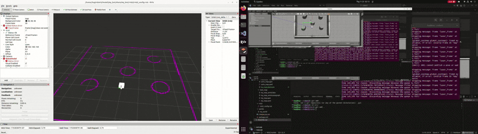
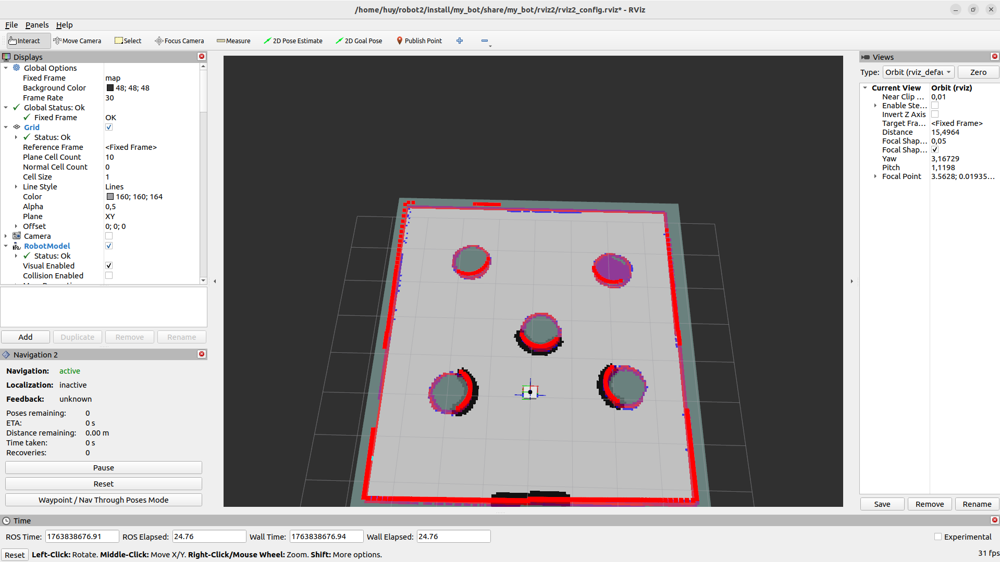

# 🤖 My Bot Simulation - ROS 2 Nav2 & SLAM & ORB_SLAM
Project mô phỏng một robot di động đơn giản (mobile robot) sử dụng ROS 2 và Gazebo. Hệ thống tích hợp sẵn Nav2 để tự hành và hỗ trợ 2 thuật toán SLAM phổ biến: Slam Toolbox và Cartographer.

## 🛠 Yêu cầu hệ thống
- OS: Ubuntu 22.04 (Jammy)
- ROS2 Distro: Humble
- Các gói phụ thuộc:
    ```bash
    sudo apt install ros-humble-navigation2 ros-humble-nav2-bringup ros-humble-slam-toolbox
    sudo apt install ros-humble-cartographer ros-humble-cartographer-ros ros-humble-gazebo-ros-pkgs ros-humble-xacro
    ```

## ⚙️ Cài đặt 
1. Clone project về workspace:
    ```bash
    mkdir -p ~/robot_ws/src
    cd ~/robot_ws/src
    git clone https://github.com/hoanggghuy/My_robot_2.git
    ```
2. Build và Source:
    ```bash
    cd ~/robot_ws
    colcon build --symlink-install
    source install/setup.bash
    ```

## 🚀 Hướng dẫn chạy
#### Project sử dụng một file launch duy nhất "launch_all.py" để quản lý toàn bộ quy trình.
1. Sử dụng Slam Toolbox
    ```bash
    ros2 launch my_bot launch_all.py headless:=False 
    ```
    

2. Sử dụng Cartographer
    ```bash
    ros2 launch my_bot launch_all.py headless:=False slam_select:=cartographer slam:=True load_state_filename:=./my_map.pbstream
    ```
    

3. Navigation

    

4. ORB_SLAM

    